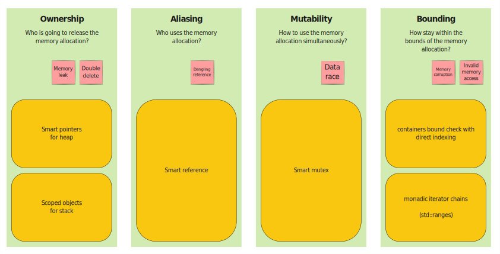
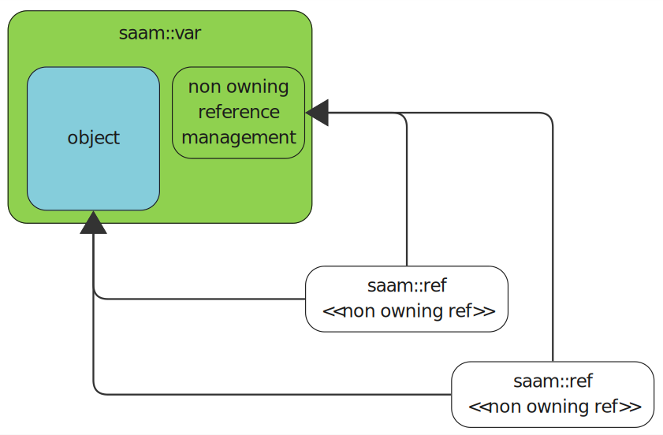
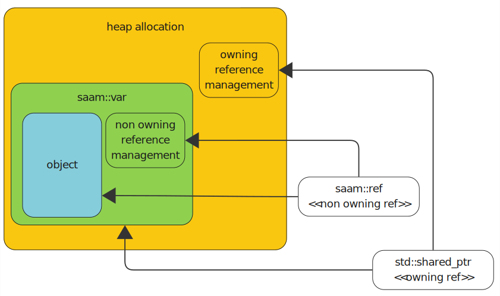
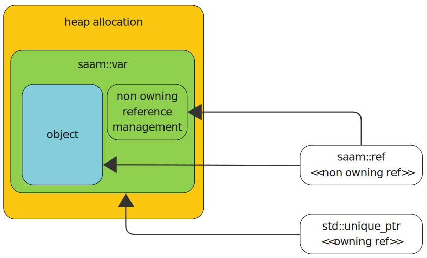

<!--
SPDX-FileCopyrightText: Leica Geosystems AG

SPDX-License-Identifier: MIT
-->

# Pillars of Safe Memory Management



## Ownership
> *Who is going to release the allocated memory?*

Problems to solve:
- No deallocation = memory leak
- Multiple deallocations

Since C++11, C++ has addressed these problems:
- Ownership of scope objects is automatically managed by the compiler via scopes and stack frames.
- Ownership of heap objects was automated by smart pointers.

## Aliasing
> *Who uses the allocated memory?*

The usage of a variable is independent of its ownership. In some cases, we just want to use an object, calling functions on it or accessing its members,
without worrying about its lifetime. We expect that its lifetime is guaranteed by an external mechanism.

Problems to solve:
- Dangling references: make sure that the lifetime assumption of a reference is guaranteed.

C++ does not provide a borrow checking mechanism like Rust. There is no way to tell from a raw reference if it is valid or not.

## Mutability
> *How to use the allocated memory simultaneously?*

Ensure safe access to the objects from multiple threads.

Problems to solve:
- Data races
- Deadlocks

Data races can be solved by enforcing the use of locked mutexes.
The current STL API does not enforce that a mutex is locked when its protected objects are accessed.

## Bounding
> *How to stay within the bounds of the allocated memory?*

How can we harden our classes, so that only the owned memory is accessed and we do not reach beyond that.

Problems to solve:
- Memory corruption / invalid read: read/write beyond the managed memory

Usage of containers (std::vector, std::map, etc.) instead of raw buffers / arrays helps keeping the access of the memory under control.
For random access of an element in the container shall be done with bound checking.
Sweeping through the container shall be done by iterator chains (std::ranges).

# Ownership model

The basic ownership model is, when the scope (code inside curly braces) controls the lifetime of a variable.
As long as the variable is in scope it is alive, as soon as the scope is left, the variable is destroyed.
This behavior is provided by the compiler. The user can extract raw references from raw variables,
the compiler does not keep track who may have access to the object.

`saam` changes this by adding a managing wrapper to keep track of the references.

The following string is still a scope variable, but it was smartened up with reference management.
```cpp
saam::var<std::string> name("Hello World");
```

`saam::var` uniquely owns the wrapped type - it is responsible to destroy it when its lifetime expires.

Note, that the `saam::var` does not provide any access to the underlying type (`std::string`).
You cannot read or write the string via `saam::var`. The only thing `saam::var` is for, is to serve as a factory for of smart references. Those references are used for the data manipulation.

This behavior is similar to smart pointers. The object on the heap is just a data storage, just like an `saam::var`.
Nobody accesses the object on the heap directly, but uses its proxies (`std::shared_ptr`, `std::unique_ptr`).
The difference here is: for smart pointers the heap object (data storage) is invisible for the outside world, for `saam::var`
it is visible.

Not providing access at the owner object is common with the smart mutex library. One needs to lock the mutex (owner object)
and the object can be accessed only via the proxy (locks).

# Aliasing model

Raw C++ references (like `int&`) are similar in capability to raw pointers (like `int*`). They are fast but do not provide any safety against dangling.

Here is a classical dangling reference example with raw variable and raw references:
```cpp
std::string& greet()
{ 
    return std::string("Hello World"); 
};
```
## Smart References

`saam` replaces raw references with `saam::ref` smart references, just like smart pointers supersede raw pointers in safe contexts.



```cpp
// The function call creates the reference implicitly from the variable
std::size_t length(saam::ref<const std::string> name) {
    return name->length();
}

saam::var<std::string> name("Hello World");
length(name);
```

References follow the smart pointer syntax. Assignment and reading are both possible because the smart reference holds a non-const object.
```cpp
void algorithm(saam::ref<std::string> name) {
    *name = "Peter";
    auto length = name->length();
}
```

The value from the variable is not directly accessible - a reference is always needed for an access.
This case, the reference is a temporary object, automatically destroyed after use.
```cpp
saam::var<std::string> name("Hello World");

auto size = name.borrow()->size();
*name.borrow() = "Welcome";
```

Advantages of smart references over raw references:
- `saam::ref` a reference is always bound to an object and this binding is never a dangling one!
- `saam::ref` can be augmented with `std::optional`, so it can be unbound, default constructed
- `saam::ref` is reassignable - unlike raw references.
- A class that owns `saam::ref`s can be copy/move assigned due to reassignability of the smart reference - unlike raw references.

## Heap variables

In some cases, when the lifetime of the scope is not enough for the variable, the variable must be moved/created on the heap.
This can extend the lifetime of the variable indefinitely.
C++ smart pointers are the safe way to do that. Smart pointers are owning references with unique and shared ownership.

The string still has the smartness regarding to aliasing (non owning references), but it resides on the heap now.
```cpp
auto name = std::make_shared<saam::var<std::string>>("Hello World");
```



```cpp
auto name = std::make_unique<saam::var<std::string>>("Hello World");
```



## Detected errors

The following snippet demonstrates returning a reference to an object that is destroyed on function exit.
The compiler often warns about this trivial case but does not necessarily report an error.
The `saam` library detects this during runtime and panics when it happens.

```cpp
saam::ref<std::string> generate_text() 
{
    saam::var<std::string> text("Hello world");
    return text;
}

auto generated_text = generate_text();
```

Another scenario is when the reference is created earlier than the variable. As the scope ends, the variable is destroyed earlier than the reference.

```cpp
std::optional<saam::ref<const std::string>> maybe_text_ref;

saam::var<std::string> text{"hello"};

maybe_text_ref = text;
```

Another classical example from Rust. The container internal buffer maybe reallocated when a new element is pushed into the container.
This reallocation invalidates existing references and this is detected by `saam`.

```cpp
std::vector<saam::var<std::string>> vec;
vec.reserve(1); // Allocate an internal buffer for only one element

vec.emplace_back("hello");
saam::ref<std::string> text_ref = vec.back();

// The new element does not fit into the current buffer (size of 1 at the moment), buffer reallocation is needed.
// The reallocation invalidates the reference (text_ref). -> PANIC!
vec.emplace_back("world");
```

In more complex situations, when the reference is stored in classes/containers/callbacks,
the compiler is likely cannot notice this situation and no warning is issued. The `saam::ref` reliably alarms in such cases, too.

## Casting references

Smart references are casted similar to the regular references.

Upcasting (derived type to base type) is always possible and it is implicit.

```cpp
saam::ref<derived> derived_ref = ......;
saam::ref<base> base_ref = derived_ref;
```

Downcasting (base type to derived type) is an explicit operation.

The correctness of the cast can be assumed, like using `static_cast`.
```cpp
saam::ref<base> base_ref = ......;
saam::ref<derived> derived_ref = base_ref.static_down_cast<derived>();
```

Or it can be checked by RTTI, like `dynamic_cast` does. If the cast fails, `std::bad_cast` is thrown - just
like for a regular reference.
```cpp
saam::ref<base> base_ref = ......;
saam::ref<derived> derived_ref = base_ref.dynamic_down_cast<derived>();
```

## Reference management modes

- raw reference
  `std::string&`
- smart reference
  `saam::ref<std::string>`
  - managed mode : the smart reference was created from a smart variable
   ```c++
   saam::var<std::string> text{"Hello World"};
   // The smart variable passes the borrow manager to the smart ref
   saam::ref<std::string> ref(text);
   ```
  - unmanaged mode : the smart reference was created from a raw variable
   ```c++
   std::string text{"Hello World"};
   // The "raw" variable passes no borrow manager to the smart ref
   saam::ref<std::string> ref(text);
   ```

### Managed
In managed mode, a `saam::ref` is created from an associated `saam::var`. The smart variable and reference have a borrow manager that keeps track of the references. With that, it is possible to check if there were dangling references when the `saam::var` was destroyed.

Only one of the managed modes can be active at a time. This is set up when the library is installed.

#### Counted
The `saam::var` uses atomic reference counting (similar to `std::shared_ptr`) to track outstanding `saam::ref` instances.
This policy incurs some performance loss when `saam::ref` is copied/moved due to counter management. Accessing the variable through `saam::ref` has no additional cost, similar to using a raw reference.

When a `saam::ref` outlives its associated `saam::var`, a panic is triggered, and the process is aborted. This abortion can be analyzed to find the invalid reference.

Define the following function, in order to be able to create a report about the panic.

``` c++
namespace saam
{
void dangling_reference_panic(const std::type_info &var_type, void *var_instance, std::size_t num_dangling_references) noexcept
{
    // Dump the panic state
}
}
```

This managed mode reliably detects the danling reference situation, but does not provide info about the dangling reference instances.

#### Tracked
When a dangling reference situation is detected, the `saam` library can identify the `saam::ref` instances that are dangling and the `saam::var` they belonged to.
The fault report includes the call stack where the `saam::var` was destroyed and the creation stack(s) of the dangling `saam::ref` instance(s). This mode requires C++23 with stacktrace support.

Define the following function, in order to be able to create a report about the panic.
This function is called for each dangling `saam::ref` on the `saam::var` that triggered the panic.

``` c++
namespace saam
{
void dangling_reference_panic(const std::type_info &var_type,
                              void *var_instance,
                              const std::stacktrace &var_destruction_stack,
                              std::size_t dangling_ref_index,
                              const std::stacktrace &dangling_ref_creation_stack) noexcept
{
    // Dump the panic state
}
}
```

This mode stores the creation stacktrace with each reference. This may be a bit too intensive to do for every ref.
Therefore by default the stack tracing is disabled, and can be enabled for a specific type or only for a specific instance.
Enabling it for a specific type is usually enough, because in `counted` mode the type that had dangling references is known,
so we just have to narrow it down to the instance to fix the dangling.

This managed mode gives the most detailed information about the danling reference situation.

#### Unchecked
No borrow checking takes place, and the `saam::ref` class behaves like an unmanaged smart reference (see below).
In this mode, managed smart references (extracted from a `saam::var`) become an unmanaged smart reference.

Use this mode for maximum performance to save the cost of the borrow checking when you are confident about the code.

### Unmanaged
When a smart reference refers to a raw C++ variable instead of a `saam::var`, then there are no borrow checks performed.

This operation is used mainly for compatibility reasons - see the legacy API section below.

### Recommended Usage

1. It is recommended to use managed `counted` mode by default.
2. When a borrowing violation is detected, the application panics and crashes.
3. In a trivial situation, the developer can identify the dangling reference by code inspection.
4. In a more complex situation, the developer recompiles the code in `tracked` mode and reproduces the error.
5. When the application runs stable, then one can consider switching to the unchecked mode for maximum performance.

### Post-constructor and pre-destructor

A `saam::var` decorated instance may have two public functions `void post_constructor(saam::current_borrow_manager_t *)` 
and a `void pre_destructor()`. If any or both of these methods present in the decorated class, then `saam::var` is going to call them timely.

In the regular C++ constructor the smart self reference is not yet available. The "this" pointer is also not considered
to be usable, because the object is not yet created.
Therefore if a post-constructor exists, it is called and there the self reference is already available.
It is ideal place to start create callbacks or any other objects, which
needs to know the smart reference of the object.

The pre-destructor is a called before `saam::var` destroys the wrapped instance. This is a great place
to put code to revoke outstanding smart references, like cancelling callbacks, etc.

## Smart `Self` reference

Sometimes object need to know their smart references.
The `saam` smart variable also offers this feature, which can be very handy for callbacks.

When a class has post-constructor, then the class receives its borrow manager there.
If necessary, then using the "this" pointer and borrow manager, smart references can be constructed.

```cpp
class my_class
{
    void post_constructor(saam::current_borrow_manager_t *borrow_manager)
    {
        borrow_manager_ = borrow_manager;
    }

    void subscribe_for_shutdown() 
    {
        // create a smart reference based on the "this" pointer and the borrow manager
        // the reference can be managed or unmanaged - depending on the borrow_manager_ pointer
        subscription_ = shutdown_controller_->on_shutdown([self = saam::ref<best_practice>(*this, borrow_manager_)]() {
            self->print_status();
        });
    }

    void print_status();

    void release_callbacks()
    {
        subscription_.release();
    }

    saam::current_borrow_manager_t *borrow_manager_{nullptr};
    signal_subscription subscription_;
    saam::ref<shutdown_controller> shutdown_controller_;
};

auto mycls = std::make_shared<var<my_class>>(......);
mycls->borrow()->subscribe_for_shutdown();

// Callback contains reference to mycls, therefore it must be released before mycls can be safely destroyed
mycls->borrow()->release_callbacks();
mycls.reset(); 

```

The borrow checker is strict here: We want to destroy the `my_class` instance. But there is an outstanding reference inside the callback registered to `shutdown_controller`,
the application will panic due to a dangling reference in the callback.

To overcome this problem, `my_class` must first revoke its callbacks before it can be destroyed.
This ensures there is no moment in the system where a dangling reference exists, not even temporarily.

This problem is similar to the `std::shared_ptr` circular reference problem. There the released circular set of objects will be leaking (memory and other resources),
because their constructor will be not called. Here, a panic is triggered when a reference in another object is still alive when the smart variable is destroyed.
Tipical scenario for this is a callback holding a reference.

> [!NOTE]
> The default `borrow_manager_` value is nullptr. A reference created with a null borrow manager, makes an unmanaged reference.
> In the `subscribe_for_shutdown` function, the `self` reference parameter will be either unmanaged or managed dependeing on the fact if the `post_constructor` is called.

An alternative solution, is to store the smart self reference in the class, but then make sure that it is freed before the
class is destructed.

```cpp
class my_class
{
    void post_constructor(saam::current_borrow_manager_t &borrow_manager)
    {
        // From this point on, smart references can be created.
        smart_self_ = saam::ref<my_class>(*this, &borrow_manager);
    }

    void pre_destructor()
    {
        // Release the self reference before destruction, so that the instance does not contain
        // a reference to self during destruction.
        smart_self_.reset();
    }

    // It is too early to create the smart_self in the constructor, hence the std::optional
    std::optional<saam::ref<my_class_with_post_constructor_and_pre_destructor>> smart_self_;
};
```

## Working with legacy API

Transitioning between smart references and raw references are always explicit. This explicitness makes the user aware of losing security.

```cpp
// The API expects a raw reference
std::size_t get_text_length(const std::string& text) 
{
    return text.length();
}

saam::var<std::string> text{"hello"};
// Create a raw reference from the smart variable
auto generated_text = get_text_length(static_cast<const std::string&>(text.borrow()));
// A shorthand way, but it is still explicit (see the asterix).
auto generated_text = get_text_length(*text.borrow());
```

Transition from raw reference to the smart reference is also explicit. Note that in such a case - even though smart references are used - there is no way to check reference validity inside the `get_text_length` function.

```cpp
// The API expects a smart reference
std::size_t get_text_length(saam::ref<std::string> text) 
{
    return text->length();
}

// Create an unmanaged smart reference from a non-smart variable.
std::string text{"hello"};
auto unmanaged_text_ref = saam::ref<std::string>(text);
auto generated_text = get_text_length(unmanaged_text_ref);
```

## Why Not Use Smart Pointers for Reference Tracking?

- Smart pointers cannot express borrowing, as they own the object - by definition (except std::weak_ptr). Only non-owning references can dangle.
- The managed object can be on the heap or stack. Smart pointers support only heap allocations.
- A smart variable in `unchecked` and `counted` mode does not make any heap allocation. In `tracked` mode heap is allocated only for the stack traces.
- Using `std::weak_ptr` as references is incorrect because converting them to `std::shared_ptr` temporarily owns the object. This can be deceiving, because the system thinks all components are destroyed, but in the background there could be something holding some of them.

## Why Not Use Garbage Collector references for Reference Tracking?

- Many garbage collectors delay the destruction of objects until a cleanup phase occurs.
  This is the opposite of the predictability provided by RAII.
- Many garbage collectors suspend all threads while the cleanup is running (stack walks), which is unacceptable for many semi-realtime applications.
- Garbage collectors encourage overuse of the heap. Allocating and releasing objects on the stack is more efficient than using the heap.
- Garbage collector references mostly implement ownership, while `saam` implements aliasing aspects.
- `saam` references are non-owning, so no "circular reference" ownership memory leak is possible with them.

# Concurrency model
The STL defines concurrency primitives (mutexes, locks, condition variables), but there is no association between these primitives and the resources they protect. `saam` enhances these primitives, just as it does with references.

## Smart mutex

`saam::synchronized` associates a mutex with the protected object instance.
Similar to `saam::var`, a `saam::synchronized` owns the object it is expected to protect.
There is no direct access to the underlying object; all access goes through the smart mutex infrastructure.

Let's create an integer and bundle it with a mutex.
```cpp
saam::synchronized<int> number(5);
```
Note that the underlying type is never a `const` type. `const` types cannot be mutated and therefore
do not require thread synchronization. Reading is safe from any number of threads without synchronization.

Similar to `saam::ref`, smart mutex uses proxy objects to provide access to the underlying type.
These are the `saam::sentinel` objects.

Create a mutable proxy from the synchronized object. The template parameter being not `const`
indicates that this is a unique lock—there can be only one at a time.
Unique locks allow reading and writing to the underlying object.
```cpp
saam::sentinel<int> locked_number_mut = number;
```

Alternatively, `saam::synchronized` factory methods can create sentinels.
This syntax is useful to create temporary sentinels in a long expression.
```cpp
auto doubled = *number.lock_mut() + *number.lock_mut();
```

Shared sentinels provide immutable (read-only) access, but multiple such sentinels may exist at the same time.
There is a factory function for this as well.
```cpp
saam::sentinel<const int> locked_number_immut = number;
auto locked_number_immut = number.lock();
```

The `synchronized` instance and its related `sentinel` instances are bound via smart references. If the
`synchronized` object is destroyed before all its `sentinel`s are released, `saam` will panic.

## Condition variables

`saam` associates condition variables with the `synchronized` object. This cohesion helps ensure that
the correct mutex is locked when a condition is waited on.

```cpp
saam::condition value_changed_condition(number);
```

Waiting for a condition variable uses familiar STL syntax.
```cpp
// sentinel assures synchrony
saam::sentinel<const int> locked_number_immut = number;

// mutex is released during waiting
// the exit criterion always takes a const type as parameter
value_changed.wait(locked_number_immut, [](const int &val) { return val > 5; });

// waiting has finished, the sentinel is locked again, and it is safe to access the variable
print(*locked_number_immut);
```

Waiting works with both immutable (see above) and mutable sentinels.
If the sentinel and the condition variable are not associated with the same synchronized object, a panic will occur.
```cpp
saam::sentinel<int> locked_number_mut = number;

value_changed.wait(locked_number_mut, [](const int &val) { return val > 5; });

// mutable sentinel allows modifications
*locked_number_mut = 10;
```

The waiting time can be limited on the wait function.
```cpp
// Relative waiting time
auto wait_result = value_changed.wait(locked_number_mut, [](const int &val) { return val > 5; }, std::chrono::milliseconds(4));
if (wait_result == saam::condition::wait_result::timeout)
    // timeout

// Or it can be absolute
wait_result = value_changed.wait(locked_number_mut, [](const int &val) { return val > 5; }, std::system_clock::time_point(........));
```

The `synchronized` instance and its related `condition` instances are bound via smart references. If the
`synchronized` object is destroyed before all its `condition`s are released, `saam` will panic.

Conditions can be triggered, similar to STL:
```cpp
// Notify all waiting threads
value_changed_condition.notify(saam::condition::notification_scope::all_waiter);
// Notify one waiting thread
value_changed_condition.notify();
```

## Synchronized member variables

The following case study shows how to synchronize member variables of a class. The example is also extended with another concept,
[Initialization Order Fiasco](https://www.youtube.com/watch?v=KWB-gDVuy_I&t=893s), which is not only useful for the smart mutex,
but also overcomes the constructor initialization list constraints.

```cpp
class my_class : public saam::enable_ref_from_this<my_class>
{
    // Data members of the class are grouped into one or more struct(s)
    // Each of these aggregates will be protected by a mutex
    struct members
    {
        int data = 0;

        static members create(int data)
        {
            // Prepare the members; the object does not exist yet
            // If something is wrong with the creation, exit at this stage

            // Push the created components into the struct
            return {.data = data};
        }
    };

    // Smart mutex to synchronize member variables
    saam::synchronized<members> sync_m;

  public:

    my_class(int data)
        // Move the members under the control of the mutex
        // Return value optimization (RVO) may eliminate the cost of this function call
        : sync_m(members::create(data))
    {
    }

    // The smart mutex is not movable (because the STL mutex is also not movable)
    // Move only the "members" from the other instance under the control of "this" smart mutex.
    my_class(my_class &&other)
        : sync_m(std::move(*other.sync_m.lock())) // Locked "other" prevents modifications in "other" during the move operation
    {
    }

    auto get_data_comparator()
    {
        // Capturing the smart reference into the callback ensures a valid call destination.
        // Lock to members is created on demand in the callback
        auto external_callback = [self = borrow_from_this()](int data_query) { return data_query == self->sync_m.lock()->data; };
        return external_callback;
    }
};


int main()
{
constexpr int value = 5;

saam::var<best_practice> bestprac(value);
auto comparator = bestprac.borrow()->get_data_comparator();

comparator(value); // Returns true, callback was successfully called
}
```

- Smart reference makes sure that callbacks do not contain invalid self reference
- There is only synchronized access to the members possible
- Callbacks have access to the synchronized members

# Smart memory-management tools

| Use case | Owner | Proxy | Destruction |
| -------- | -------- | ------- | ------- |
| Heap object | Heap allocation | std::shared_ptr, std::unique_ptr | released with last reference
| Scoped object | saam::var | saam::ref | released with object
| Synchronized object | smart mutex | smart lock | released with object |

For all use cases, the `Owner` itself is just a container, it is not accessed directly.
All access goes through `Proxy` types.

# Cost of saam abstractions

## Unchecked mode

It provides no extra functionality over the raw variable and references, and therefore it has
zero cost compared to raw references.

There is not functionality in this mode, so neither the `saam::var` nor the `saam::ref`
takes up more space than a raw scoped variable or a raw reference.

## Counted mode

The cost of the counted mode is quite moderate compared to the extra safety it provides.

The `saam::var` contains an atomic integer counter on top of the size of the raw scoped variable.
This counter is incremented by each copy of the reference.
Moving a reference does not change the reference counter, so it is just the cost of copying the address.
Dereferencing costs nothing, because the compiler optimizes away the abstraction to return the address.

`saam::ref` contains a pointer to the owner `saam::var`. Otherwise it contains the address
of the referred object, just like the raw reference. From the memory point of view, it contains two pointers
instead of one (like a raw reference).

## Tracked mode

This is the most capable and the most expensive abstraction.

The `saam::var` contains a pointer to the owned reference chain 
(and a boolean for enabling the stack tracing) on top of the size of the raw scoped variable.
Copy/Move is more expensive than in the counted mode, because the linked list must be modified.
Dereferencing costs nothing, for the same reason as for the counted mode.

`saam::ref` contains an std::stack_trace (this is a large object with heap allocations) and
a pointer to the next ref in the chain and a pointer to the owner `saam::var`.
Otherwise it contains the address of the referred object, just like the raw reference.

The overhead of the tracked mode can be reduced by enabling the stack trace collection only
for a specific type or for a specific instance.
The default policy is to turn off the stack trace collection.

Enable the stack trace collection for all smart std::string variables.
```cpp
saam::var<std::string>::enable_type_stack_tracking(true);
```

Enable the stack trace collection only for a specific smart std::string variable instance.
```cpp
saam::var<std::string> text;
text.enable_instance_stack_tracking(true);
```

# Dynamic vs static reference management

The rust borrow checker is a static analysis on the references.
It aims for two goals:
- prevent dangling references
- avoid data races

Sometime the static analysis cannot predict the runtime behavior of the code and it rejects code, that would be otherwise ok.
The dynamic analysis overcomes this limitation - but for some runtime cost.

The `saam` library solves the two goals (see above) as two separate problems.

Dangling references problem is addressed by the smart variables/references. This infrastructure does not impose any limitations
on the reference distribution. One can pull as many mutable and immutable references as they wish. At this point we only
focus to distribute the reference in the system. Accessing the data behind them is not yet a concern.

Data race does not occur when the reference is distributed, but when the reference is accessed. For a single
threaded application, it is not possible to have a data race - regardless if we have multiple mutable references or not.
One thread cannot conflict with itself.
For multithreaded cases, it is important that we can have either multiple immutable access or a single mutable access.
With the smart mutex this check happens when the protected object is accessed (via locks) and only for the duration of the access.
For the rust static borrow checker this requirement is enforced for the full lifetime of the reference and not only for
the moment when it is accessed. That is what makes the static borrow checker in rust so strict.
